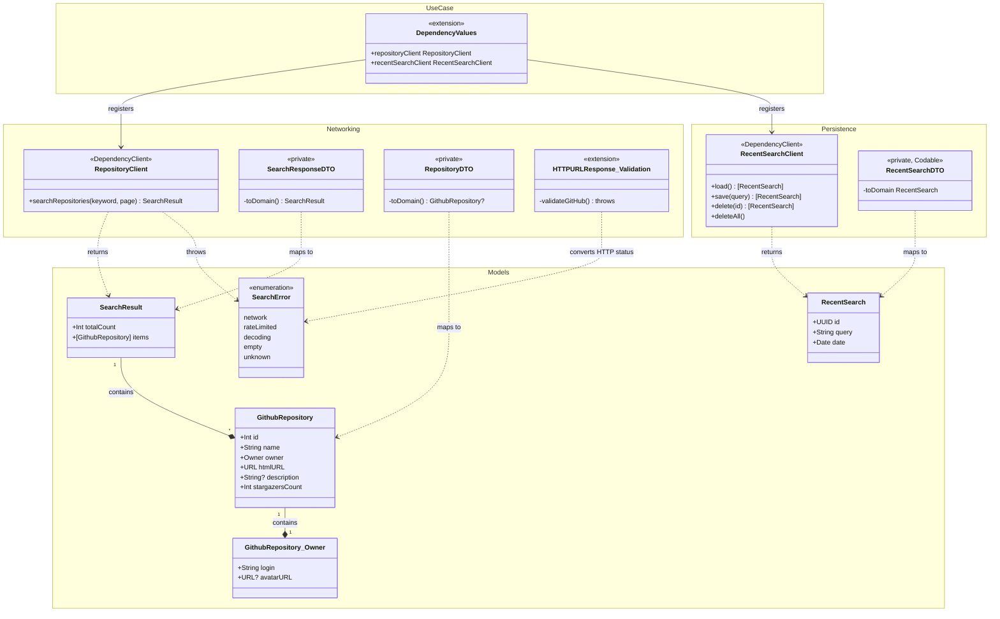

# Core 단계 산출물

## 생성 파일 및 모듈

| 모듈 | 파일 | 역할 |
|------|------|------|
| Domain/Models | `GithubRepository.swift` | 저장소 도메인 모델 (Owner 중첩 타입 포함) |
| Domain/Models | `SearchResult.swift` | 검색 결과 래퍼 (totalCount + items) |
| Domain/Models | `RecentSearch.swift` | 최근 검색어 도메인 모델 |
| Domain/Models | `SearchError.swift` | 도메인 에러 열거형 (network / rateLimited / decoding / empty / unknown) |
| Core/Networking | `RepositoryClient.swift` | GitHub Search API 클라이언트 (@DependencyClient), DTO→도메인 변환, HTTP 상태→SearchError 변환 내장 |
| Core/Persistence | `RecentSearchClient.swift` | UserDefaults 기반 최근 검색어 클라이언트 (@DependencyClient), 최대 10개 유지, 중복 시 날짜 갱신 |
| Domain/UseCase | `RecentSearchClientKey.swift` | RecentSearchClient DependencyKey 등록 + DependencyValues 확장 |
| Domain/UseCase | `RepositoryClientKey.swift` | RepositoryClient 키 위임 안내 (실 등록은 Networking 모듈 소유) |

## 핵심 결정

| 항목 | 결정 내용 |
|------|-----------|
| 에러 변환 전략 | `URLError` → `SearchError.network`, HTTP 403 → `rateLimited`, 422 → `network`, JSON 디코딩 실패 → `decoding`, 빈 결과 → `empty` |
| DependencyKey 소유 경계 | `RepositoryClient`의 DependencyKey는 Networking 모듈이 직접 소유. `RecentSearchClient`의 DependencyKey는 UseCase 레이어가 별도 파일로 등록 |
| DTO 가시성 | `SearchResponseDTO`, `RepositoryDTO`, `OwnerDTO`, `RecentSearchDTO` 모두 `private`으로 모듈 외부 노출 차단 |
| 최근 검색어 동시성 | `RecentSearchClient` 클로저 전부 `@Sendable`로 선언, UserDefaults 접근은 단일 스레드 순차 실행 보장 |
| 빈 결과 처리 | `items.isEmpty` 시 `SearchError.empty`를 throw해 UI에서 빈 상태 구분 가능하도록 함 |

## 미해결 / TODO

| 항목 | 내용 |
|------|------|
| 인증 토큰 | GitHub API 토큰 헤더 미적용 — rate limit 60 req/h 제한 있음 |
| 페이지 끝 감지 | `totalCount` 대비 누적 items 수로 마지막 페이지 판별 로직은 Feature 레이어 책임 |
| UserDefaults 동시성 | 다수 클로저 동시 호출 시 race condition 가능성 — actor 격리 검토 필요 |

## 다이어그램

