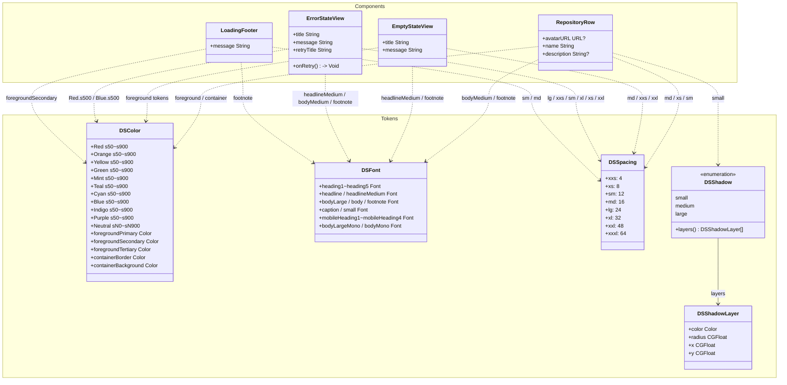

# Design System — 단계 산출물

## 생성 파일 목록

### 토큰 (Tokens)

| 파일 | 역할 | 주요 내용 |
|------|------|-----------|
| `Projects/Core/DesignSystem/Sources/DSColor.swift` | 색상 토큰 | 팔레트 11종(Red/Orange/Yellow/Green/Mint/Teal/Cyan/Blue/Indigo/Purple/Neutral) 각 s50~s900 스케일; 시맨틱 5종(foregroundPrimary/Secondary/Tertiary, containerBorder, containerBackground) 라이트·다크 분기 |
| `Projects/Core/DesignSystem/Sources/DSColor+Hex.swift` | 색상 유틸 | `Color(hex:)` / `Color.dsDynamic(light:dark:)` 익스텐션 |
| `Projects/Core/DesignSystem/Sources/DSTypography.swift` | 타이포그래피 토큰 | `DSFont` — Inter(sans) heading1~5 · headline · body · footnote · caption · small 및 모바일 변형; Roboto Mono(mono) 시리즈; `Font` 시스템 익스텐션 ds* |
| `Projects/Core/DesignSystem/Sources/DSSpacing.swift` | 간격 토큰 | 이름 있는 단계 xxs(4)~xxxl(64) + 전체 수치 scale 배열 |
| `Projects/Core/DesignSystem/Sources/DSShadow.swift` | 그림자 토큰 | `DSShadow` enum — small/medium/large 3단계, 각각 3-layer 복합 그림자; `View.dsShadow(_:)` 편의 수정자 |

### 공통 컴포넌트 (Components)

| 파일 | 컴포넌트 | 역할 | 사용 토큰 |
|------|----------|------|-----------|
| `Projects/Core/DesignSystem/Sources/Components/RepositoryRow.swift` | `RepositoryRow` | 저장소 아바타·이름·설명 행 뷰 (공개 모듈용) | DSColor, DSFont(bodyMedium/footnote), DSSpacing(md/xs/sm/xxs), DSShadow(.small) |
| `Projects/Core/DesignSystem/Sources/Components/EmptyStateView.swift` | `EmptyStateView` | 검색 결과 없음 전용 안내 화면 | DSColor(foreground 3종), DSFont(headlineMedium/footnote), DSSpacing(md/xxs/xxl) |
| `Projects/Core/DesignSystem/Sources/Components/ErrorStateView.swift` | `ErrorStateView` | 오류 상태 안내 + 재시도 버튼 화면 | DSColor(Red.s500/Blue.s500/Neutral.sN0/foreground), DSFont(headlineMedium/bodyMedium/footnote), DSSpacing(lg/xxs/sm/xl/xs/xxl) |
| `Projects/Core/DesignSystem/Sources/Components/LoadingFooter.swift` | `LoadingFooter` | 리스트 하단 페이지네이션 로딩 인디케이터 행 | DSColor(foregroundSecondary), DSFont(footnote), DSSpacing(sm/md) |

### 참고 (피처 레이어 로컬 컴포넌트)

| 파일 | 비고 |
|------|------|
| `Projects/Features/SearchResult/Sources/Component/RepositoryRowView.swift` | SearchResult 피처 전용 Row — DesignSystem 모듈 외부. `DSColor`/`DSFont` 일부 미적용(Color 익스텐션 직접 참조). 추후 `RepositoryRow`로 교체 검토 필요 |

---

## 핵심 결정

| 항목 | 결정 내용 |
|------|-----------|
| 팔레트 구조 | 11개 색상 계열 × s50~s900(10단계) + Neutral sN0~sN900(13단계)로 Figma 원본과 동일 네이밍 유지 |
| 시맨틱 토큰 | 라이트·다크 모드를 `dsDynamic(light:dark:)` 단일 진입점으로 해결 — `@Environment(\.colorScheme)` 분기 없음 |
| 타이포 폰트 패밀리 | Inter(sans) + Roboto Mono(mono) 커스텀 폰트 + 시스템 폰트 ds* 익스텐션 병행 제공 |
| 그림자 | 3단계(small/medium/large) 각각 3-layer 복합 구조 — `View.dsShadow(_:)` 수정자로 적용 |
| 간격 | 이름 단계(xxs~xxxl)와 원시 수치 배열(scale) 이중 제공 |
| 컴포넌트 공개 범위 | DesignSystem 모듈에서 `public` 선언 — 모든 피처 모듈이 임포트 없이 재사용 가능 |

---

## 미해결 / TODO

| 항목 | 내용 |
|------|------|
| 시맨틱 색상 미결 | `containerBackground` 라이트 모드 Figma 원본이 그라디언트/투명 스워치 — 솔리드 값 확인 필요 |
| 미결 시맨틱 토큰 4종 | Container Divider(Light/Dark), Text Gradient Primary/Secondary — 그라디언트 계열, `Color` 단일 값으로 변환 불가; 별도 `LinearGradient` 토큰 결정 필요 |
| `RepositoryRowView` 정리 | 피처 레이어 로컬 구현과 DesignSystem의 `RepositoryRow` 중복 — 이후 피처 스프린트에서 DesignSystem 버전으로 단일화 |
| 접근성 테스트 | Preview에 `.accessibility3` Dynamic Type 있으나 자동화 스냅샷 테스트 미작성 |

---

## 다이어그램

