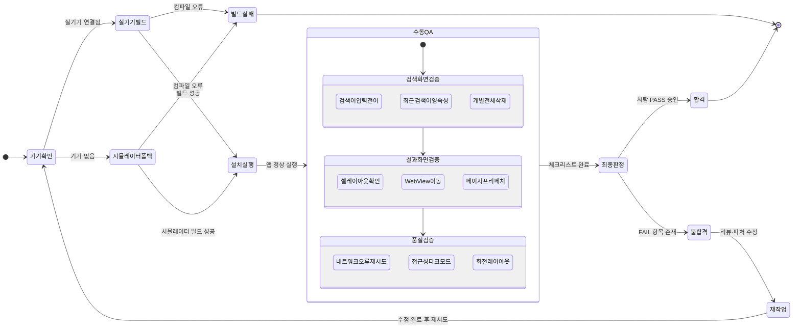
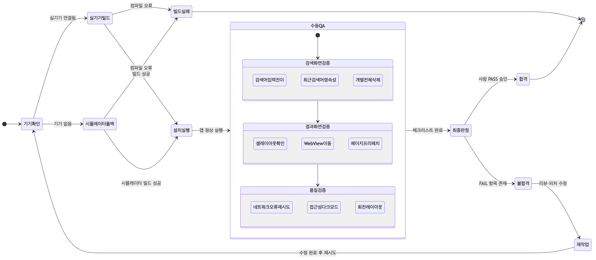

# Device Verify 단계 산출물

## 실기기 빌드·설치·수동 QA 상태 전이

---

## 절차 단계 목록

| 단계 | 도구 | 설명 |
|---|---|---|
| 기기 확인 | `xcrun devicectl list devices` | 연결된 실기기 존재 여부 판별 |
| 실기기 빌드 | `tuist generate` + `xcodebuild` | `-destination "platform=iOS,name=<device>"` |
| 시뮬레이터 폴백 | `xcodebuild` | 실기기 없을 때 iPhone 15 시뮬레이터 대체 |
| 앱 설치·실행 | `xcrun devicectl device install app` | UDID 지정 설치 후 실행 |
| 수동 QA | 체크리스트 | 검색화면·결과화면·품질 3개 그룹 |
| 최종 판정 | 사람 게이트 | 자동 판정 금지, 사람이 PASS/FAIL 결정 |

---

## 수동 QA 체크리스트 항목

| 그룹 | 항목 |
|---|---|
| 검색화면 | 검색어 입력 → 결과 화면 전이 |
| 검색화면 | 빈 검색어 시 최근 검색어 최대 10개·날짜 내림차순 |
| 검색화면 | 최근 검색어 개별 삭제 / 전체 삭제 |
| 검색화면 | 앱 강제종료 후 재실행 시 최근 검색 유지 (영속성) |
| 검색화면 | 최근 검색어 선택 시 검색 실행 |
| 검색화면 | 입력 중 자동완성 + 검색 날짜 노출 |
| 결과화면 | 총 검색 결과 수 표시 |
| 결과화면 | 셀: 썸네일 / 저장소명 / 소유자명 |
| 결과화면 | 셀 선택 시 WebView로 저장소 이동 |
| 결과화면 | 스크롤 중 다음 페이지 프리페치 + 로딩 인디케이터 |
| 결과화면 | 페이지 실패 시 인라인 재시도 |
| 품질 | 네트워크 끊김·rate limit 시 에러 메시지 + 재시도 동작 |
| 품질 | VoiceOver 라벨, Dynamic Type 확대, 다크모드 정상 |
| 품질 | 회전·세이프에어리어·노치 레이아웃 깨짐 없음 |

---

## 핵심 결정

| 결정 | 내용 |
|---|---|
| 최종 판정 주체 | 자동화 금지 — 모든 체크리스트 항목 PASS/FAIL을 사람이 직접 확인 |
| 기기 없을 때 | 시뮬레이터(iPhone 15)로 폴백하되, 실기기 미사용 사실을 명시 |
| FAIL 처리 | `/review` 또는 피처 재구현 트랙으로 연결 후 기기확인부터 재시도 |
| 빌드 도구 | `tuist generate --no-open` → `xcodebuild` → `xcrun devicectl` 순 |

---

## 미해결 / TODO

| # | 항목 | 비고 |
|---|---|---|
| 1 | 실기기 UDID별 QA 결과 기록 방법 미정 | 기기마다 결과 표 별도 관리 여부 검토 필요 |
| 2 | 자동화 가능 품질 항목 분리 | VoiceOver·Dynamic Type은 UI Test 자동화 후보 |
| 3 | FAIL 시 재작업 범위 기준 미정 | 리뷰 단계 재진입 vs 피처 단위 재구현 판단 기준 필요 |
