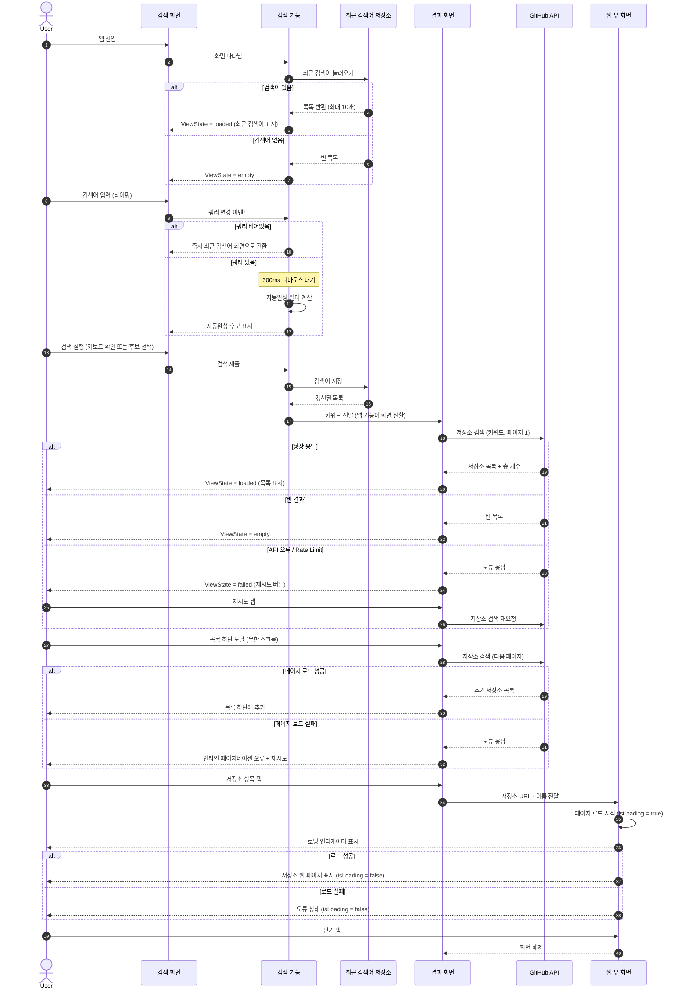
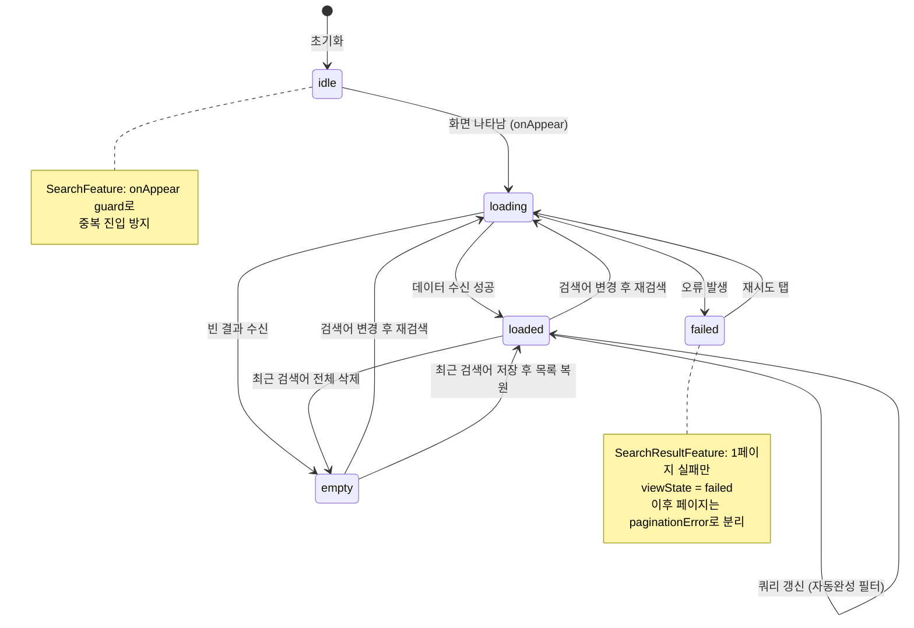

# Features 단계 산출물

## 생성 파일 및 모듈

| 모듈 | 파일 | 역할 |
|------|------|------|
| App | `AppMain.swift` | 앱 진입점 · AppFeature(검색+스택 네비게이션) · AppRootView |
| Features/Search | `SearchFeature.swift` | 검색어 입력 · 300ms 디바운스 자동완성 · 최근 검색어 CRUD · ViewState 관리 |
| Features/Search | `SearchView.swift` | 검색 화면 UI |
| Features/SearchResult | `SearchResultFeature.swift` | GitHub API 호출 · 무한 스크롤 페이지네이션 · 재시도 · ViewState 관리 |
| Features/SearchResult | `SearchResultView.swift` | 결과 목록 화면 UI |
| Features/SearchResult | `RepositoryRowView.swift` | 저장소 목록 셀 컴포넌트 |
| Features/RepositoryWeb | `RepositoryWebFeature.swift` | 웹 페이지 로드 상태(isLoading) 관리 · 닫기 처리 |
| Features/RepositoryWeb | `RepositoryWebView.swift` | WKWebView 래퍼 화면 |

## 핵심 결정

| 항목 | 결정 내용 |
|------|-----------|
| 화면 전환 전략 | AppFeature가 `SearchFeature.searchSubmitted`와 `SearchResultFeature.repositoryTapped`를 인터셉트해 `StackState<Path>`에 push. 각 Feature는 네비게이션 로직 미보유 |
| 디바운스 구현 | `ContinuousClock.sleep(300ms)`를 `.cancellable(cancelInFlight: true)`로 감싸 이전 작업 자동 취소. 쿼리 비어있으면 디바운스 없이 즉시 상태 전환 |
| 페이지네이션 분기 | 1페이지 실패 → `viewState = .failed`, 이후 페이지 실패 → `paginationError`(인라인). `currentPage`는 성공 후 +1하여 누적 관리 |
| 마지막 페이지 감지 | `repositories.count < totalCount` 비교로 `hasNextPage` 결정. `totalCount`는 첫 응답 기준 고정 |
| 쿼리 공백 처리 | 검색 제출 시 `trimmingCharacters(in: .whitespaces)` 적용 후 빈 문자열이면 화면 전환 차단 |
| ViewState 공유 | `SearchFeature`와 `SearchResultFeature` 모두 동일 구조의 `ViewState(idle/loading/loaded/empty/failed)` 독립 정의 |

## 미해결 / TODO

| 항목 | 내용 |
|------|------|
| 자동완성 소스 | 현재 로컬 최근 검색어 필터만 사용. 서버 사이드 자동완성 미구현 |
| 페이지네이션 재시도 | `retryPaginationTapped` 시 `currentPage`를 그대로 사용 — 앱 재진입 후 동기화 검증 필요 |
| 웹 뷰 오류 화면 | `pageLoadFailed` 상태에서 별도 오류 UI 미정의 (isLoading = false만 처리) |
| 접근성 | VoiceOver 레이블 · 동적 글꼴 대응 미확인 |

## 런타임 흐름 다이어그램

## ViewState 상태 머신

`SearchFeature`와 `SearchResultFeature`가 공통으로 사용하는 ViewState 전이.

