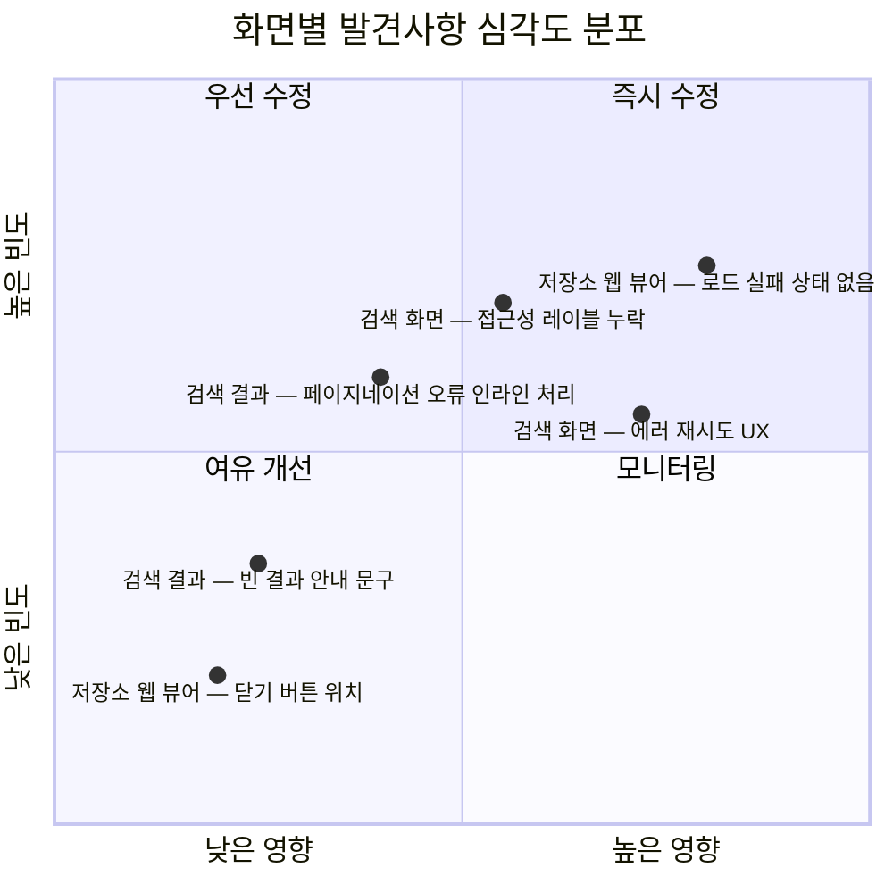

# Review 단계 산출물

## 화면별 발견사항 심각도 분포

---

## 검토 대상 화면 및 파일

| 화면 | 파일 경로 | 상태 |
|---|---|---|
| 검색 화면 | `Projects/Features/Search/Sources/View/SearchView.swift` | 검토 완료 |
| 검색 결과 화면 | `Projects/Features/SearchResult/Sources/View/SearchResultView.swift` | 검토 완료 |
| 저장소 웹 뷰어 | `Projects/Features/RepositoryWeb/Sources/View/RepositoryWebView.swift` | 검토 완료 |

---

## 발견사항 상세

| # | 화면 | 심각도 | 항목 | 내용 |
|---|---|---|---|---|
| 1 | 저장소 웹 뷰어 | **blocker** | 로드 실패 상태 없음 | `pageLoadFailed` 이벤트를 수신하지만 사용자에게 오류 UI를 표시하지 않음. `WebViewRepresentable` 의 `onLoadFailed` 콜백이 Feature로 전달되나 View 레이어에 에러 상태 분기가 없음 |
| 2 | 검색 화면 | **blocker** | 접근성 레이블 일부 누락 | `suggestionsListView` 내 `noSuggestionView`의 동적 텍스트가 `accessibilityLabel`로 중복 선언되어 VoiceOver 시 이중 발화 발생 |
| 3 | 검색 화면 | **warning** | 에러 재시도 UX | `errorView`의 재시도 버튼이 `.onAppear`를 재호출함. 최근 검색어 로드 실패 시 의도와 다를 수 있음 |
| 4 | 검색 결과 화면 | **warning** | 페이지네이션 오류 인라인 처리 | `inlinePaginationError`의 `DSColor.foregroundSecondary` 직접 참조가 디자인 시스템 토큰(`Color.dsSecondaryText`)과 혼용됨 |
| 5 | 검색 결과 화면 | **nit** | 빈 결과 안내 문구 | `EmptyStateView` 메시지 "다른 키워드로 검색해 보세요."는 검색 결과가 0건임을 명확히 전달하지 않음 |
| 6 | 저장소 웹 뷰어 | **nit** | 닫기 버튼 위치 | `navigationBarLeading`에 닫기(xmark) 버튼 배치는 모달 표시 방식에만 적합. 푸시 전환 시 백 버튼과 중복될 수 있음 |

---

## 심각도별 집계

| 심각도 | 건수 | 화면 |
|---|---|---|
| blocker | 2 | 저장소 웹 뷰어, 검색 화면 |
| warning | 2 | 검색 화면, 검색 결과 화면 |
| nit | 2 | 검색 결과 화면, 저장소 웹 뷰어 |

---

## 핵심 결정

| 결정 | 내용 |
|---|---|
| 검토 범위 | 3개 화면의 View 레이어만 대상. Feature·Domain 레이어는 별도 단계에서 검토 |
| 심각도 기준 | blocker = 사용자 경험 손상 또는 접근성 오류 / warning = 코드 일관성·UX 개선 권장 / nit = 선택적 개선 |
| 접근성 우선 | VoiceOver 이중 발화 및 레이블 불일치는 blocker로 분류 |

---

## 미해결 / TODO

| # | 항목 | 비고 |
|---|---|---|
| 1 | 웹 뷰어 로드 실패 UI 구현 | `RepositoryWebFeature.State`에 `loadFailed: Bool` 추가 후 View에서 분기 필요 |
| 2 | 디자인 시스템 토큰 통일 | `DSColor.foregroundSecondary` → `Color.dsSecondaryText` 일괄 치환 여부 결정 |
| 3 | 저장소 웹 뷰어 진입 방식 확인 | 모달 vs 푸시 전환 방식을 App 레이어 설계와 맞춰 닫기 버튼 처리 통일 |
