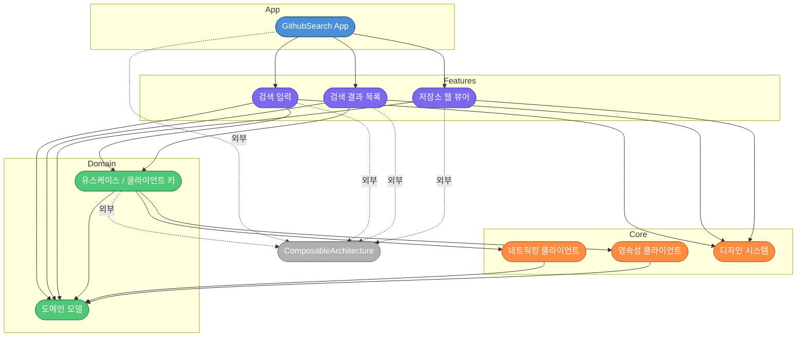

# Scaffold 단계 산출물

## 모듈 의존 그래프

---

## 생성 파일 / 모듈

| 레이어 | 모듈 | 경로 | 역할 |
|---|---|---|---|
| App | GithubSearch App | `Projects/App/` | 진입점, 루트 스토어, Feature 조합 |
| Features | 검색 입력 | `Projects/Features/Search/` | 검색어 입력, 디바운스, 최근 검색어 표시 |
| Features | 검색 결과 목록 | `Projects/Features/SearchResult/` | 저장소 목록 렌더링, 페이지네이션 |
| Features | 저장소 웹 뷰어 | `Projects/Features/RepositoryWeb/` | WebView로 저장소 상세 표시 |
| Domain | 도메인 모델 | `Projects/Domain/Models/` | GithubRepository, RecentSearch, SearchResult, SearchError |
| Domain | 유스케이스 / 클라이언트 키 | `Projects/Domain/UseCase/` | RepositoryClientKey, RecentSearchClientKey (TCA DependencyKey) |
| Core | 네트워킹 클라이언트 | `Projects/Core/Networking/` | RepositoryClient (GitHub API) |
| Core | 영속성 클라이언트 | `Projects/Core/Persistence/` | RecentSearchClient (로컬 저장) |
| Core | 디자인 시스템 | `Projects/Core/DesignSystem/` | DS토큰 + 공용 컴포넌트(RepositoryRow, EmptyState, ErrorState, LoadingFooter) |

---

## 핵심 결정

| 결정 | 내용 |
|---|---|
| 레이어 방향 | 단방향 의존: App → Features → Domain/Core. 역방향 참조 없음 |
| 외부 의존 격리 | ComposableArchitecture는 App·Features·Domain/UseCase에서만 직접 참조. Core/Networking·Persistence는 미사용 |
| 도메인 모델 위치 | Domain/Models가 최하위 노드(의존 없음). 네트워킹·영속성 모두 모델을 상향 참조 |
| 클라이언트 키 분리 | UseCase 모듈이 TCA DependencyKey만 선언. 실 구현(Live)은 Core에 위치해 테스트 교체 가능 |
| 디자인 시스템 독립 | DesignSystem은 Domain 비참조. 순수 UI 토큰·컴포넌트만 포함 |

---

## 미해결 / TODO

| # | 항목 | 비고 |
|---|---|---|
| 1 | Features 간 직접 의존 없음 확인 필요 | Search → SearchResult 내비게이션은 App 레이어에서 조율해야 함 |
| 2 | Core/Networking Live 구현 위치 | 현재 Sources에 RepositoryClient 단일 파일, Live/Test 분리 여부 미확정 |
| 3 | AppTests 커버리지 | 현재 빈 테스트 파일, 루트 스토어 통합 테스트 작성 필요 |
