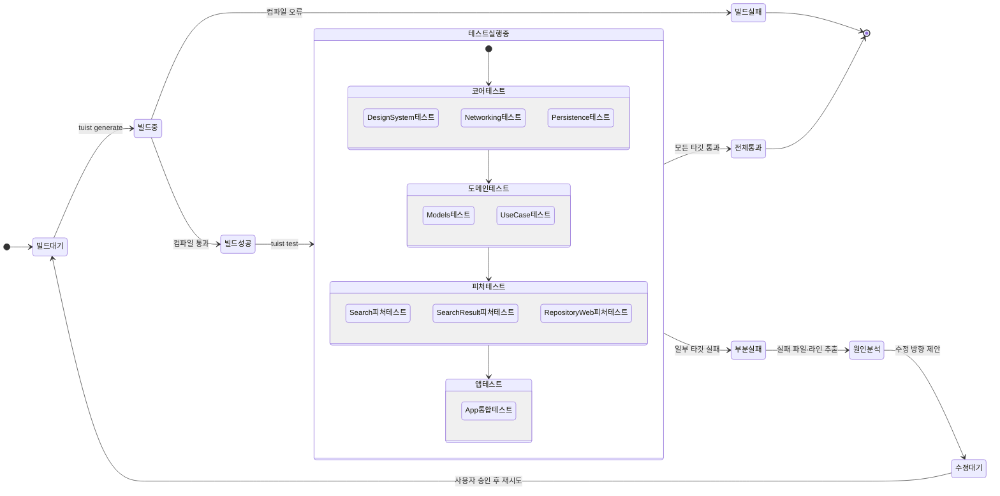

# Verify 단계 산출물

## 빌드·테스트 상태 전이

---

## 테스트 타깃 목록

| 레이어 | 타깃 | 테스트 파일 |
|---|---|---|
| Core | DesignSystem | `Projects/Core/DesignSystem/Tests/DesignSystemTests.swift` |
| Core | Networking | `Projects/Core/Networking/Tests/NetworkingTests.swift` |
| Core | Persistence | `Projects/Core/Persistence/Tests/PersistenceTests.swift` |
| Domain | Models | `Projects/Domain/Models/Tests/ModelsTests.swift` |
| Domain | UseCase | `Projects/Domain/UseCase/Tests/UseCaseTests.swift` |
| Features | Search | `Projects/Features/Search/Tests/SearchFeatureTests.swift` |
| Features | SearchResult | `Projects/Features/SearchResult/Tests/SearchResultFeatureTests.swift` |
| Features | RepositoryWeb | `Projects/Features/RepositoryWeb/Tests/RepositoryWebFeatureTests.swift` |
| App | App | `Projects/App/Tests/AppTests.swift` |

---

## 핵심 결정

| 결정 | 내용 |
|---|---|
| 빌드 도구 | `tuist install && tuist generate --no-open` → `tuist test` 순서로 실행 |
| 실패 보고 형식 | 파일 경로 : 라인 번호 : 실패 사유 형식으로 추출 |
| 자동 수정 정책 | 실패 발생 시 수정 방향만 제안, 실제 코드 변경은 사용자 승인 후 진행 |
| 테스트 실행 순서 | Core → Domain → Features → App 레이어 순 (의존성 방향 준수) |

---

## 미해결 / TODO

| # | 항목 | 비고 |
|---|---|---|
| 1 | Review 단계 blocker 수정 후 재검증 필요 | 웹 뷰어 로드 실패 UI 미구현, 접근성 레이블 오류 |
| 2 | 디자인 시스템 토큰 혼용 수정 검증 | `DSColor.foregroundSecondary` → `Color.dsSecondaryText` 치환 여부 |
| 3 | 실제 `tuist test` 실행 결과 미확인 | 현재 단계는 구조·절차 문서화 단계; 실행 결과는 verify 커맨드 수행 시 갱신 |
